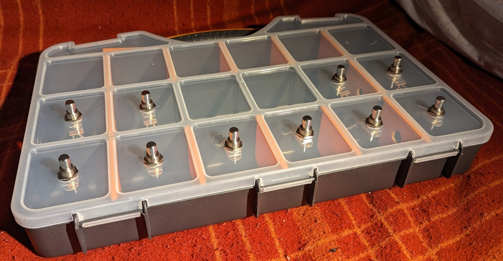
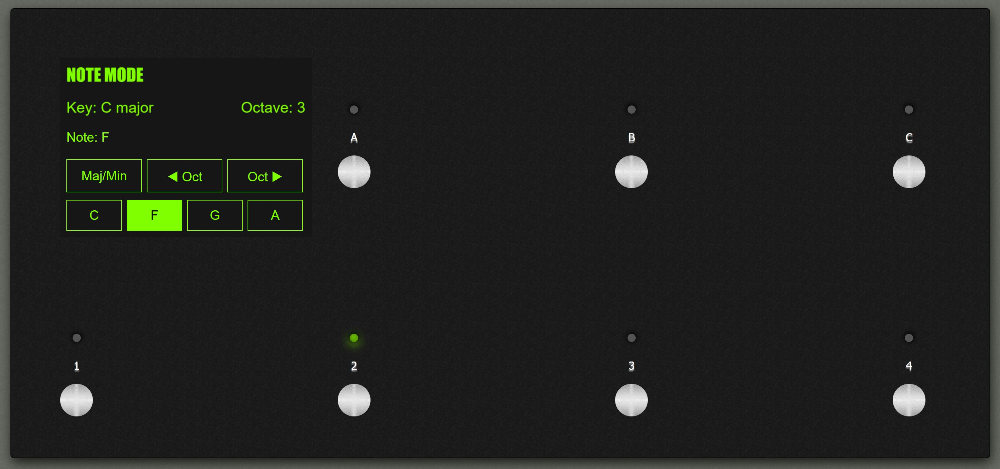
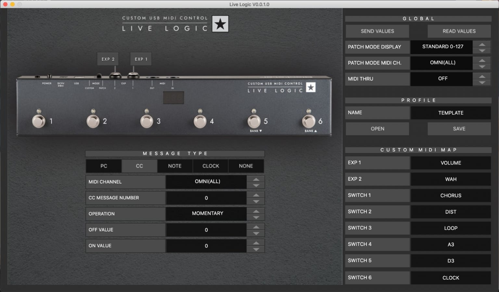

# MIDI Pedal Board

I have an idea to build a MIDI pedal board for sending MIDI messages to a laptop while I'm playing guitar. It could send note messages (to trigger samples), or program changes (to change effects) or many other combinations.

Videos like [this by Hacker Shack](https://www.youtube.com/watch?v=M25I58I7BtI) and [this by Notes and Volts](https://www.youtube.com/watch?v=H3WevrsmO9o) make it look easy - well, at least not crazy difficult. And parts are both easy to obtain and cheap.

Specialised parts, like [this sloped aluminuim enclosure](https://uk.farnell.com/bopla/atph-1865-300/case-aluminium-68x300x181mm/dp/1843600), could give the unit a real professional finish. And by adding [a TFT touchscreen](https://www.pjrc.com/store/display_ili9341_touch.html) I could build something really powerful - and completely bespoke to me.

Easy, right?

## Prototype One

The first prototype I have built is housed in a plastic box (the kind with compartments used to store screws). This box was £6.99, a whole lot cheaper than buying a proper aluminium enclosure. By luck the compartments are pretty much exactly the right spacing for the buttons.

The parts I got were:

- [Teensy 4.1](https://www.pjrc.com/store/teensy41.html), the brains of the unit
- [Soft-touch footswitches](https://www.amazon.co.uk/dp/B073S4YVF4?psc=1&ref=ppx_yo2ov_dt_b_product_details) (the clicking ones would be loud and annoying)
- Breadboard, jumper wires, and LEDs from [pimoroni.com](https://shop.pimoroni.com/)
- [2.8 ince ILI9341 TFT touchscreen](https://www.amazon.co.uk/dp/B09Z29CGY1?psc=1&ref=ppx_yo2ov_dt_b_product_details)
- [COmpartment organiser box](https://www.bmstores.co.uk/products/kingmann-20-compartment-multi-purpose-organiser-18-392691)

The code was written in C++ using the excellent Arduino IDE, with libraries and help from [pjrc.com](https://www.pjrc.com).

There are currently two 'sketches' (the name for Arduino scripts):

- MTP: a sketch to make the Teensy act as a mass storage device so the JSON config file can be copied to it
- ChordPlayer: makes the unit send chords (multiple MIDI notes at once) as accompianment. I plan to use this with synth pad sounds while I'm playing guitar.

This initial prototype has a few features, mostly built to try out how all this stuff works!

- 5 of the buttons send chords, which can be defined in the config file for each key
- Ability to change key (clockwise or anti-clockwise) round the cycle of fifths)
- 4 "registers" per key. A register is where the chords are on the keyboard - low, middle, high or wide (i.e. a chord spread across 3/4 octaves)
- Ability to change MIDI channel so I can change patches

I hope to have a video demonstration available soon.

## HTML prototype

Before I started physically building anything I made a pure software prototype. In the `html-prototype` folder you'll find several files related to this prototype written in HTML, CSS and JavaScript. I know these technologies pretty well, so felt I could make a lot of progress quickly.

`13-buttons.html` was the initial idea for this unit, with 13 buttons. However, I printed out the design on paper at scale and the buttons were too close together to be usable by my big feet!

`drawing.svg` and `drawing.pdf` are the diagram I created to print out on paper (A4 paper is 297mm long, and the unit is 300mm long, which is close enough for jazz)

`7-buttons.html` was my next design, with 7 buttons. This is definitely more comfortable to play - and meant I could put the screen in landscape mode.

`index.html` is the next version, still with 7 buttons but using a JSON configuration file to define the modes and actions of each button (or set of buttons) for each mode.

`config-example.json` is the example config file, in JSON format. This config would define what the buttons do - making the unit a platform which could do pretty much anything the user wanted it to. While a nerd like me could edit configs like this by hand, if anyone else were to use this a GUI to edit the file would be necessary. I imagine something like the Blackstar Live Logic app:

